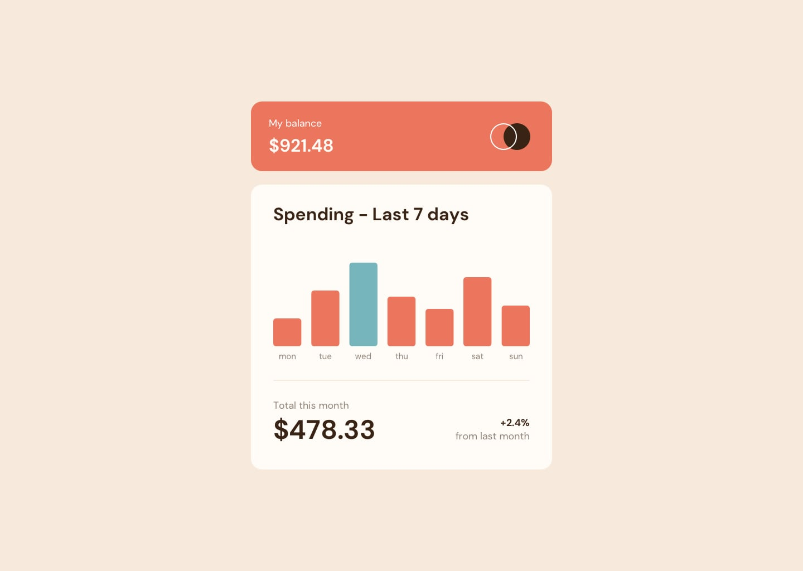

# Expenses Chart Component

A responsive, interactive expenses chart component that displays weekly spending data with dynamic bar visualization and hover tooltips.



## 🚀 Demo

View the live demo: [Add your live site URL here]

## 📋 Table of Contents

- [Overview](#overview)
- [Features](#features)
- [Screenshots](#screenshots)
- [Technologies Used](#technologies-used)
- [Getting Started](#getting-started)
- [File Structure](#file-structure)
- [How It Works](#how-it-works)
- [What I Learned](#what-i-learned)
- [Acknowledgments](#acknowledgments)

## 🎯 Overview

This project is a solution to the [Expenses chart component challenge on Frontend Mentor](https://www.frontendmentor.io/challenges/expenses-chart-component-e7yJBUdjwt). The challenge focuses on building a dynamic chart component that fetches data and displays it with interactive visualizations.

### The Challenge

Users should be able to:

- View the bar chart and hover over individual bars to see detailed amounts
- See the current day's bar highlighted in a different color
- View the optimal layout for the content depending on their device's screen size
- See hover states for all interactive elements

## ✨ Features

- **Dynamic Data Loading**: Fetches spending data from JSON file with error handling
- **Interactive Tooltips**: Custom-styled tooltips appear on hover showing exact amounts
- **Current Day Highlight**: Automatically detects and highlights today's bar in cyan
- **Responsive Design**: Adapts seamlessly to different screen sizes
- **Smooth Animations**: Opacity transitions on hover for better UX
- **Proportional Bar Scaling**: Bars scale relative to the highest spending amount

## 📸 Screenshots

### Desktop View


### Mobile View


## 🛠️ Technologies Used

- **HTML5**: Semantic markup
- **CSS3**: Styling via Tailwind CSS
- **JavaScript (ES6+)**: 
  - Async/await for data fetching
  - DOM manipulation
  - Event listeners
  - Array methods (map, forEach)
- **Tailwind CSS (CDN)**: Utility-first styling with custom color configuration
- **Google Fonts**: DM Sans font family

## 🚦 Getting Started

### Prerequisites

- A modern web browser
- A local server (recommended: VS Code Live Server extension)

### Installation

1. Clone the repository:
```bash
git clone https://github.com/yourusername/expenses-chart-component.git
```

2. Navigate to the project directory:
```bash
cd expenses-chart-component
```

3. Open with a local server:
   - **VS Code**: Right-click `index.html` → "Open with Live Server"
   - **Python**: `python -m http.server 8000`
   - **Node.js**: `npx serve`

4. Open your browser and navigate to `http://localhost:5500` (or your server's URL)

> **Note**: Opening the HTML file directly (`file://`) won't work due to CORS restrictions on fetching `data.json`

## 📁 File Structure

```
expenses-chart-component/
│
├── index.html          # Main HTML structure
├── script.js           # JavaScript logic and chart rendering
├── data.json          # Spending data (7 days)
├── README.md          # Project documentation
│
├── images/
│   ├── favicon-32x32.png
│   └── logo.svg
│
└── design/            # Design reference files (optional)
    ├── desktop-design.jpg
    └── mobile-design.jpg
```

## ⚙️ How It Works

### Data Flow

```
Page Load → Fetch data.json → Process data → Calculate max amount → Render bars → Attach event listeners
```

### Key Functions

**`getData()`**
- Fetches spending data from `data.json`
- Handles errors with fallback data
- Returns promise with data array

**`getMaxAmount(data)`**
- Finds the highest spending amount
- Used for proportional bar scaling

**`createBar(dayData, maxAmount, isCurrent)`**
- Creates individual bar elements
- Applies colors based on current day
- Attaches hover event listeners

**`renderChart()`**
- Clears existing chart
- Loops through data to create all bars
- Main rendering function

**`showTooltip()` / `hideTooltip()`**
- Displays/hides custom tooltip on hover
- Positions tooltip above active bar

### Data Format

`data.json` structure:
```json
[
  { "day": "mon", "amount": 17.45 },
  { "day": "tue", "amount": 34.91 },
  ...
]
```

## 📚 What I Learned

### Technical Skills

- **Async JavaScript**: Proper use of async/await for data fetching
- **DOM Manipulation**: Creating elements dynamically with JavaScript
- **Event Handling**: Adding interactive hover effects and tooltips
- **CSS Positioning**: Absolute positioning for tooltip placement
- **Array Methods**: Using `.map()`, `.forEach()`, and `Math.max()` effectively

### Problem-Solving

- **Tailwind CDN Limitations**: Learned that dynamically created elements need inline styles when using Tailwind CDN
- **Percentage vs Pixels**: Understood why percentage heights require explicit parent heights
- **Memory Management**: Discovered potential memory leaks with event listeners on re-rendered elements

### Code Snippets I'm Proud Of

**Dynamic bar height calculation:**
```javascript
const containerHeight = 160;
const calcHeight = (dayData.amount / maxAmount) * containerHeight;
barDiv.style.height = `${calcHeight}px`;
```

**Current day detection:**
```javascript
const days = new Date().getDay();
const weekdays = ['sun', 'mon', 'tue', 'wed', 'thu', 'fri', 'sat'];
const currentDay = weekdays[days];
```

## 🎨 Design Specifications

### Colors

- **Soft Red**: `hsl(10, 79%, 65%)`
- **Cyan**: `hsl(186, 34%, 65%)`
- **Dark Brown**: `hsl(25, 47%, 15%)`
- **Medium Brown**: `hsl(28, 10%, 53%)`
- **Cream**: `hsl(27, 66%, 92%)`
- **Very Pale Orange**: `hsl(33, 100%, 98%)`

### Typography

- **Font Family**: DM Sans
- **Weights**: 400 (Regular), 700 (Bold)

## 🤝 Acknowledgments

- Challenge by [Frontend Mentor](https://www.frontendmentor.io)
- Coded by [Max Mendes](https://github.com/Max-Mendes91)
- Special thanks to Claude AI for guidance and code review

## 📝 License

This project is open source and available under the [MIT License](LICENSE).